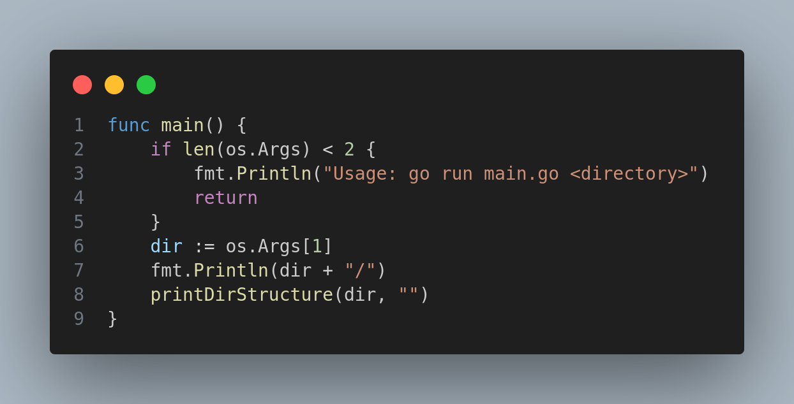

# Folder Structure Visualizer

This Go application visualizes the folder structure of a specified directory. It prints out the structure in a tree-like format directly to the terminal, offering a quick and intuitive way to understand the directory's layout.

## Code Explanation

### Importing Necessary Packages
The application imports essential packages such as `fmt`, `io/ioutil`, `os`, and `path/filepath` to handle file I/O operations and manipulate file paths.

### The `printDirStructure` Function
This is a recursive function that reads and prints the structure of the given directory. It uses `ioutil.ReadDir` to read the directory contents and iterates through them, printing each item. If it encounters a sub-directory, it calls itself recursively to print the sub-directory's contents.

```go

