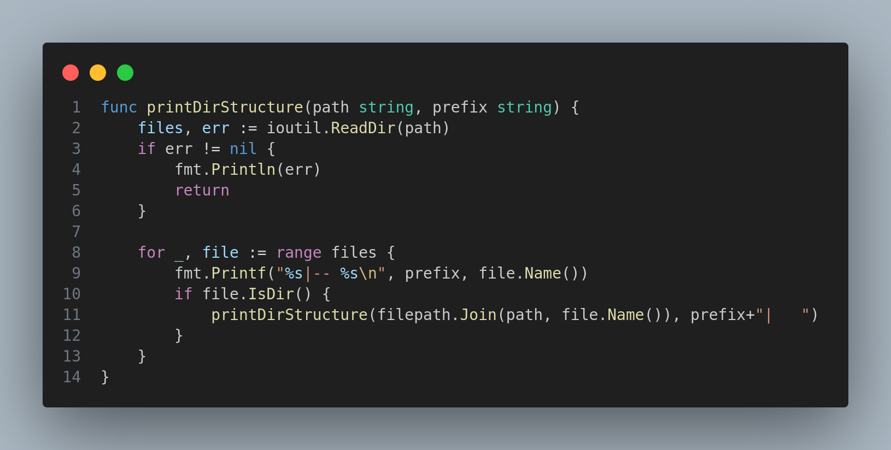

# Folder Structure Visualizer

This Go application visualizes the folder structure of a specified directory. It prints out the structure in a tree-like format directly to the terminal, offering a quick and intuitive way to understand the directory's layout.

## Code Explanation

### Importing Necessary Packages
The application imports essential packages such as `fmt`, `io/ioutil`, `os`, and `path/filepath` to handle file I/O operations and manipulate file paths.

### The `printDirStructure` Function
This is a recursive function that reads and prints the structure of the given directory. It uses `ioutil.ReadDir` to read the directory contents and iterates through them, printing each item. If it encounters a sub-directory, it calls itself recursively to print the sub-directory's contents.



## Installation and Running

### Clone the repository to your local machine:
```sh
git clone https://github.com/your-username/folder-visualizer.git
cd folder-visualizer
```
Note: Replace your-username with your actual GitHub username and folder-visualizer with your actual repository name.

```sh
go run main.go /absolute/path/to/directory
```
For help run
```sh
go run main.go -h
```
Ensure to replace /absolute/path/to/directory with the actual path of the directory you want to visualize.

### License
This project is open-source and available under the MIT License. Refer to the [LICENSE](https://github.com/git/git-scm.com/blob/main/MIT-LICENSE.txt) file for more details.